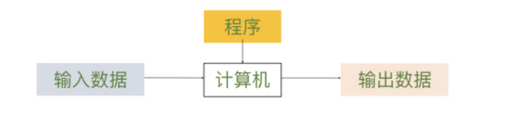
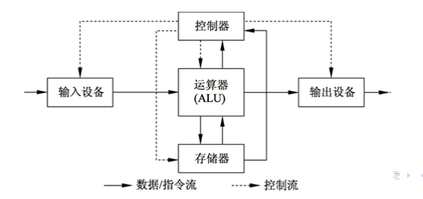

# Note for Introduction of Conmputer Science
<div align = right>By Grantley-W in CEO of NKU.</div align = right>

[toc]

```
写在前面：
本笔记标号统一采用以下顺序：一、1.  (1)
考试会考的知识点以引用方式总结 使用> 进行标注
重点全部以==高亮==形式标注
所有示例代码均使用python编写，部分使用伪代码
```
## 零 导论
计算机的两套结构：冯诺依曼结构、图灵结构
- 图灵结构：
- 冯诺依曼结构：

==二者根本区别：冯结构可以将程序储存在计算机的存储器中，图灵结构不行==

硬件三大子系统：中央处理器、主存储器、输入输出子系统

## 一 数据结构

### 1 数据与结构

> 考点：二、八、十、十六进制转换（整数和小数都要熟练）

位：bit 一个0/1 8个bit组成一个byte，是计算机处理数据的最小单位

常考汇编指令：
- load R1, address ：把address里的数值读取到R1寄存器里
- mov R1, constant / mov R2, R1
- add/sub R2, R1, constant ：R2 = R1 +- constant
- add/sub R3, R1, R2 : R3 = R1 +- R2
- shiftl/shiftr R3, R1, R2 :左右移指令 R3 = R1 左/右移动R2位

### 2 数组
 二维数组的行主序存储：对于 object[i][j], 有：y = x + cols * (i-1) + (j-1)

 数组的增改删查：
 - 增：所有数据从后往前依次后移一位，再插入元素
 - 改：根据数组索引直接修改
 - 删：数据依次往前一位覆盖
 - 查：下标索引
  ```
    例：删去30个数的数组中第6个元素
    i = 5
    while i< 30 :
        arr[i] = arr[i+1]
        i = i+1
    arr[30] = 0
  ```

 应用场景：需要大量查找、检索操作

 ### 3 记录（类似C++里的类）

```
class Student:
    def __init__(self, id, name):
        self.id = id
        self.name = name
    def Give_id(self, temp):
        self.id = temp

Student_Obj = Student(2111212,"Grantley")
print(Student_Obj.name)
```

### 4 链表
每个元素包含两部分：指向下一个元素的地址和节点携带的数据
链表的开始：头指针；链表的结束：尾部空指针
增改删查：均使用pre和cur两个指针
- 增：三种情况
  - 开始处插入：
    ```
    if pre = NULL:
        (*new).next = cur
        list = new  #list是链表开始的指针，指向第一个节点
    ```
  - 末尾插入：
    ```
    if cur = NULL:
        (*pre).next = new
        (*new).next = NULL
    ```
  - 中间插入：在pre和cur之间插入
    ```
    (*new).next = cur
    (*pre).next = new
    ```
- 查：需要遍历列表，返回指向找到节点的指针。只能顺序查找。
- 改：在查的基础上修改
- 删：两种情况
  ```
  删除首节点：list = (*cur).next
  删除中间或尾部节点：(*pre).next = (*cur).next
  ```
双向链表：每个节点两个指针域，指向相连的前一个节点和后一个节点

### 5 栈和队列
抽象数据类型：不需要知道任务如何完成，只需要知道能做哪些操作

1. 栈：stack 后进先出数据结构
基本操作：push pop empty
实现方法：数组/链表
应用：数据的倒转、进制转换  **迷宫问题** 
（==迷宫问题算法掌握==）

2. 队列：queue 先进先出数据结构。数据只能在尾部插入，头部删除。
基本操作：入列、出列

### 6 广义线性表
概念：插入、删除等操作可以在表头、表尾、中间任何地方的顺序表
基本操作：插入、删除、遍历、检索

### 7 算法复杂度
概念：当输入规模趋于无穷时，程序时间、空间的增长量级 
运算性质：
- 对于顺序结构，T(n) = O[max(f(n),g(n))]
- 选择结构：取决于then或else语句执行次数
- 循环结构：T(n) = O(f(n) x g(n))

### 8 经典算法思想
#### （1）递归
核心思想：从n层整体问题中隐去部分问题，再判断剩余部分是否为n-1层。如果是，则为递归结构

*经典例子：斐波那契数列问题*
```
# F(n) = F(n-1) + F(n-2)
def fbnq_func(n):
  if (n == 1 or n == 2):return 1
  else return fbnq_func(n-1) + fbnq_func(n-2)
```

*PPT例题：仅使用append()和len()Merge两个列表：*

```
# merge(L1,L2)
final_list = []
def Merge(L1,L2):
    global final_list
    if len(L1) == 0: final_list = final_list + L2;return
    if len(L2) == 0:final_list = final_list + L1;return
    else:
        if L1[0] <= L2[0]: 
            final_list.append(L1[0])
            Merge(L1[1:],L2)
        elif L1[0] > L2[0]:
            final_list.append(L2[0])
            Merge(L1,L2[1:])

list1 = [1,2,3]
list2 = [-6,-3,4,9]
Merge(list1,list2)
print(final_list)
```
#### （2）分治
利用二分法的思想，将大的问题转换成两个小问题
例如：取一个数组的最小值：
```
Min_Func(1,n) = min(Min_Func(1,n/2),Min_Func(n/2+1,n))
```

#### （3）贪心算法
考虑局部最优，而不是全局最优解。例：找硬币问题


