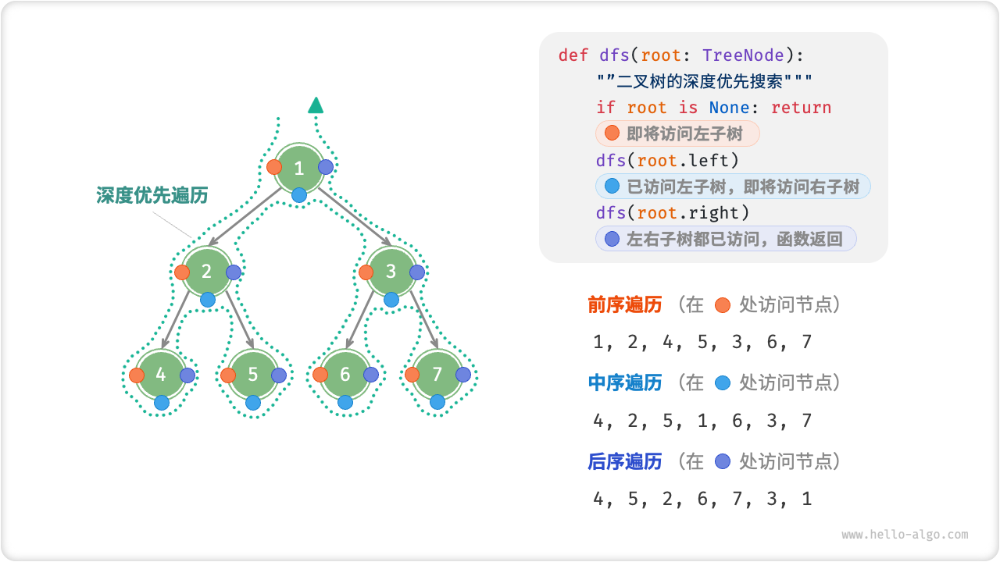
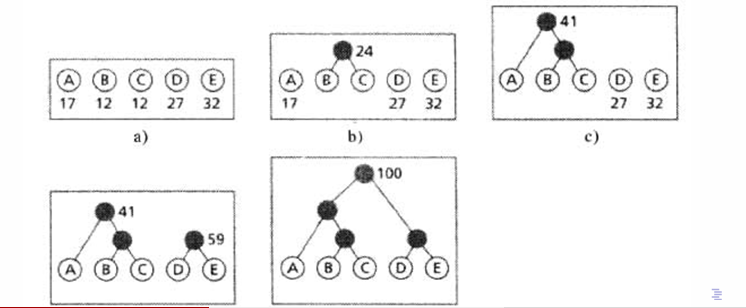

# Note for Introduction of Conmputer Science
<div align = right>By Grantley-W in CEO of NKU.</div align = right>

[toc]

```
写在前面：
本笔记标号统一采用以下顺序：一、1.  (1)
考试会考的知识点以引用方式总结 使用> 进行标注
重点全部以==高亮==形式标注
所有示例代码均使用python编写，部分使用伪代码
```
## 零 导论
计算机的两套结构：冯诺依曼结构、图灵结构
- 图灵结构：
- 冯诺依曼结构：

==二者根本区别：冯结构可以将程序储存在计算机的存储器中，图灵结构不行==

硬件三大子系统：中央处理器、主存储器、输入输出子系统

cache的作用：弥补CPU和内存之间运算速度的差异 容量小但速度高（多次反复调用的数据是少数的）

## 一 数据结构

### 1 数据与结构

 ==考点：二、八、十、十六进制转换（整数和小数都要熟练）==

位：bit 一个0/1 8个bit组成一个byte，是计算机处理数据的最小单位

常考汇编指令：
- load R1, address ：把address里的数值读取到R1寄存器里
- mov R1, constant / mov R2, R1
- add/sub R2, R1, constant ：R2 = R1 +- constant
- add/sub R3, R1, R2 : R3 = R1 +- R2
- shiftl/shiftr R3, R1, R2 :左右移指令 R3 = R1 左/右移动R2位

### 2 数组
 二维数组的行主序存储：对于 object[i][j], 有：y = x + cols * (i-1) + (j-1)

 数组的增改删查：
 - 增：所有数据从后往前依次后移一位，再插入元素
 - 改：根据数组索引直接修改
 - 删：数据依次往前一位覆盖
 - 查：下标索引
  ```
    例：删去30个数的数组中第6个元素
    i = 5
    while i< 30 :
        arr[i] = arr[i+1]
        i = i+1
    arr[30] = 0
  ```

 应用场景：需要大量查找、检索操作

 ### 3 记录（类似C++里的类）

```
class Student:
    def __init__(self, id, name):
        self.id = id
        self.name = name
    def Give_id(self, temp):
        self.id = temp

Student_Obj = Student(2111212,"Grantley")
print(Student_Obj.name)
```

### 4 链表
每个元素包含两部分：指向下一个元素的地址和节点携带的数据
链表的开始：头指针；链表的结束：尾部空指针
增改删查：均使用pre和cur两个指针
- 增：三种情况
  - 开始处插入：
    ```
    if pre = NULL:
        (*new).next = cur
        list = new  #list是链表开始的指针，指向第一个节点
    ```
  - 末尾插入：
    ```
    if cur = NULL:
        (*pre).next = new
        (*new).next = NULL
    ```
  - 中间插入：在pre和cur之间插入
    ```
    (*new).next = cur
    (*pre).next = new
    ```
- 查：需要遍历列表，返回指向找到节点的指针。只能顺序查找。
- 改：在查的基础上修改
- 删：两种情况
  ```
  删除首节点：list = (*cur).next
  删除中间或尾部节点：(*pre).next = (*cur).next
  ```
双向链表：每个节点两个指针域，指向相连的前一个节点和后一个节点

### 5 栈和队列
抽象数据类型：不需要知道任务如何完成，只需要知道能做哪些操作

1. 栈：stack 后进先出数据结构
基本操作：push pop empty
实现方法：数组/链表
应用：数据的倒转、进制转换  **迷宫问题** 
（==迷宫问题算法掌握==）

2. 队列：queue 先进先出数据结构。数据只能在尾部插入，头部删除。
基本操作：入列、出列

### 6 广义线性表
概念：插入、删除等操作可以在表头、表尾、中间任何地方的顺序表
基本操作：插入、删除、遍历、检索

### 7 算法复杂度
概念：当输入规模趋于无穷时，程序时间、空间的增长量级 
运算性质：
- 对于顺序结构，T(n) = O[max(f(n),g(n))]
- 选择结构：取决于then或else语句执行次数
- 循环结构：T(n) = O(f(n) x g(n))

==二分法找硬币问题掌握==
### 8 经典算法思想
#### （1）递归
核心思想：从n层整体问题中隐去部分问题，再判断剩余部分是否为n-1层。如果是，则为递归结构

*经典例子：斐波那契数列问题*
```
# F(n) = F(n-1) + F(n-2)
def fbnq_func(n):
  if (n == 1 or n == 2):return 1
  else return fbnq_func(n-1) + fbnq_func(n-2)
```

*PPT例题：仅使用append()和len()Merge两个列表：*

```
# merge(L1,L2)
final_list = []
def Merge(L1,L2):
    global final_list
    if len(L1) == 0: final_list = final_list + L2;return
    if len(L2) == 0:final_list = final_list + L1;return
    else:
        if L1[0] <= L2[0]: 
            final_list.append(L1[0])
            Merge(L1[1:],L2)
        elif L1[0] > L2[0]:
            final_list.append(L2[0])
            Merge(L1,L2[1:])

list1 = [1,2,3]
list2 = [-6,-3,4,9]
Merge(list1,list2)
print(final_list)
```
#### （2）分治
利用二分法的思想，将大的问题转换成两个小问题
例如：取一个数组的最小值：
```
Min_Func(1,n) = min(Min_Func(1,n/2),Min_Func(n/2+1,n))
```

#### （3）贪心算法
考虑局部最优，而不是全局最优解。例：找硬币问题

### 9 树
#### (1) 基本术语
节点：数据+指向子树的引用
叶子：树中度为0的节点
树的高度：树中节点的最大层次值
```
# 二叉树：每个节点只有两个分支

class TreeNode:
  def __init__(self,val: int):
    self.val :int = val
    self.left: TreeNode | None = None
    self.right: TreeNode | None = None

```
满二叉树：深度为k且有2^k^-1个节点的二叉树

完全二叉树：二叉树只有最底层的节点没有被填满，且最底层节点尽量靠左填充

#### (2) 树的存储结构

1. 双亲表示法： data+parent
2. 孩子表示法： data+*child 每个节点都有指向孩子节点的指针域，构成多重链表
3. 孩子兄弟表示法： firstchild + data + brother 以二叉链表作为存储结构
 ==要求：看树用方法写/还原出树==
#### (3) 二叉树的遍历

- 广度优先：从根到叶，从左到右依次访问

- 深度优先：分为前序、中序、后序遍历



==考点：给一个二叉树，写不同遍历的节点顺序、给遍历结果写原二叉树==

> 已知结果写二叉树：
> 1. 看前序和后序结果，找根节点
> 2. 划分左右子树
> 3. 重复上述步骤


#### (4) 二叉树的应用

赫夫曼树：对于出现频繁的字符给与短编码，出现较少的字符分配长编码

步骤：
1. 将所有字符排成一排
2. 权重最小的两个结合在一起，往上形成一个新的节点，权重为两个字符之和
3. 节点再多次重复(2)，直到所有节点都连成一棵树

==考点：ppt例题 会设计Huffman编码==



优点：可以实现数据压缩，同时没有一个编码是其他编码的前缀（树的特性）


### 10 图

#### （1）图的概念
图研究数据多对多的关系。通常表示为：$G(V,E)$，其中 $V$ 表示vertex（顶点），$E$ 代表边的集合

表示法：
- 邻接链表 适合稀疏图，存储空间 $O(|V| + |E|)$
- 邻接矩阵 存储空间需求$O(|V|^2)$，适合稠密图

有向图的转置：将图中所有边的方向反过来得到新的图

#### （2）最小生成树MST

生成树：包含图中$n$个顶点和只满足构成一棵树的$n-1$条边
最小生成树：对于带权的连通图，代价最小的生成树

最小生成树经典算法：Prim算法、Kruskal算法

- Prim算法：从一个顶点出发，先选择权值最小的边，到达下一个节点；再选择两个节点相连的权值最小的边到第三个节点；以此类推直到连接所有节点
算法复杂度：$O(V^2)$。适用于稠密图。
- Kruskal算法：对所有边的权值进行排序，依次选取权值最小的，如果成环了就舍去，直到总共有$n-1$条边为止。算法复杂度：$O(e log(e))$。适用于稀疏图。（主要是因为用到了大规模排序）
  
两个算法的区别：Prim从节点出发，依次选取现有网络下权值最小的边进行拓展；Kruskal从全图角度，对所有边的权值进行排序再选择。两种算法都可以得到最优解。

#### （3）图的最短路径问题

最短路径：在权重有向图中一个节点到另一个节点走过边的权重之和的最小值
- Bellman-Ford算法
边的权重可以为负值，但当存在负环路时返回false。基本思路：
从起点开始，到所有未知节点的距离为无穷。每次遍历所有的边，更新到节点的最短距离，直到遍历$n-1$次为止。
> 思路比较简单，但是比较暴力，只要有一个节点的距离改变就需要全部重新遍历。当有负环会出现n次更新后和n-1次更新后距离不一样。


- Dijkstra算法
边的权重不能有负值。1. 从一个顶点出发，每次从未标记的节点中选择一个距离起点最近的节点，标记。此节点即在最优路径集合中。2. 对于刚加入的节点，更新其临近节点和原点之间的距离，若比当前已知距离小，则更新距离。
> 思路核心：一个节点最短路径的子路径仍然是最短路径。从已知距离且没标记的节点里面排序，选最小的，标记，就在最优路径上。


#### （4）图的关键路径问题

关键路径：从源到汇的最长路径，表示整个工程完成所需的最短时间。

关键活动：关键路径上的活动。判断依据：活动开始的最早时间$e(i)$=最晚时间$l(i)$

$e(i)$：前一些顶点的最早完成时间到这个顶点的最大时间开销
$l(i)$：保证不拖延整个项目时间的条件下，该事件发生的最晚时间

最早时间：从源开始，往后递推每个节点的最大开销
最晚时间：从汇开始，往前递推每个节点的最小开销

如果两个时间相等，则其处于关键路径上。


==必考，上图必须会==


